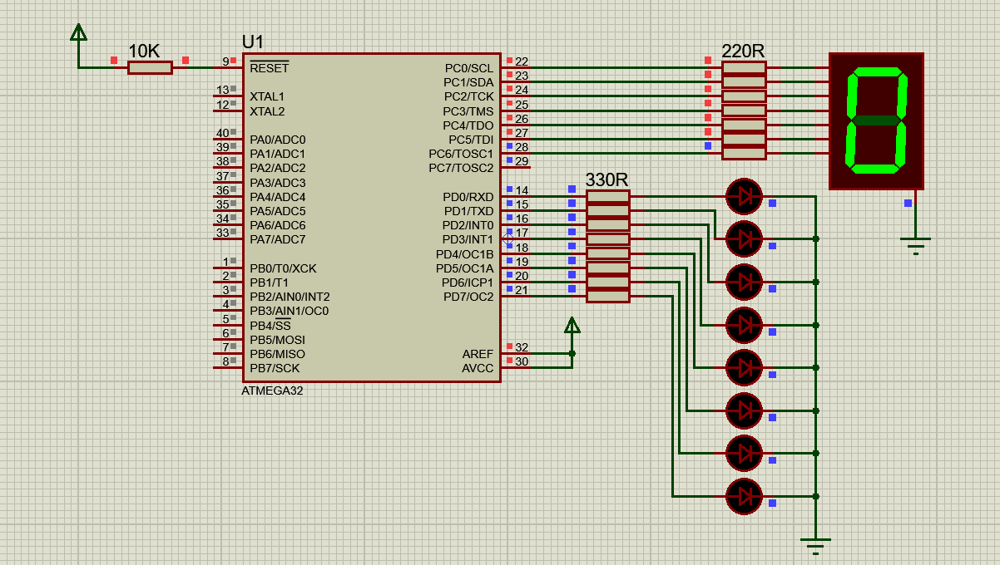

<!-- PROJECT TITLE -->
<h1 align="center">7 Segment And LEDs Counter Interfacing With Atmega32</h1>

<!-- OVERVIEW -->
## <br>**➲ Overview**
This project demonstrates how to interface a common cathode 7-segment display (specifically the 5161AS) with an ATmega32 microcontroller with 8MHZ internal frequency. The display is used to count numbers from 0 to 9, and the corresponding LEDs connected to the ATmega32 are controlled accordingly. The project is designed to help you understand 7-segment display interfacing and how to manage external components using a microcontroller.

<!-- HARDWARE REQUIREMENTS -->
## <br>**➲ Hardware Requirements**
* IMTSchool Development Kit (or a compatible hardware setup)
* USBASP Programmer (or another suitable programmer)
* Jumper wires

<!-- SOFTWARE REQUIREMENTS -->
## <br>**➲ Software Requirements**
* <a href="https://www.eclipse.org/downloads/packages/release/2023-06/r/eclipse-ide-cc-developers" target="_blank">Eclipse IDE</a> 
* <a href="https://www.labcenter.com/downloads/" target="_blank">Proteus</a> 
* <a href="https://sourceforge.net/projects/winavr/" target="_blank">WinAVR</a> 
* <a href="https://www.fischl.de/usbasp/" target="_blank">USBASP driver</a> 

**NOTE:** you can install another simulation program like multisim and another IDE like Microship studio or VS code with external compiler, anything can work all you need is to compile the project to generate hex file.

<!-- PROJECT STRUCTURE -->
## <br>**➲ Project Structure**
The project is structured as follows:
* main.c: The main application code responsible for counting and controlling the LEDs based on the 7-segment display's value.
* STD_TYPES.h: A header file containing standard data types for the project.
* BIT_MATH.h: A header file containing bit manipulation macros.
* DIO Driver:
  * DIO_Program.c: The source code for the DIO driver functions.
  * DIO_Interface.h: The interface (header) file for the DIO driver.
  * DIO_Register.h: Register addresses for the DIO driver.
* 7 Segment Driver:
  * 7SEG_Program.c: The source code for the 7SEG driver functions.
  * 7SEG_Interface.h: The interface (header) file for the 7SEG driver.
  * 7SEG_Config.h: Configurations for the 7SEG driver.

<!-- GETTING STARTED -->
## <br>**➲ Getting Started**
1. **Hardware Setup:**
   * Connect the 7-segment display to Port C of the ATmega32 microcontroller, and connect the 8 LEDs to Port D. 

2. **Software Setup:**
* Install Eclipse IDE on your computer.
* Set up Proteus for simulation.
* Install the USBASP Programmer software and ensure your programmer is connected.
3. **Clone the Repository:**
```sh
git clone https://github.com/omaarelsherif/7-Segment-Interfacing-With-LEDs-Counter-Using-Atmega32.git
```
4. **Build the project:**
   * Build the project using Eclipse IDE or any another IDE
   * Use the USBASP Programmer to flash the ATmega32 with the generated hex file.
5. Run the Simulation:
   * If you want to simulate the project, open it in Proteus and run the simulation.
6. Observe the Counter:
   * The 7-segment display will count from 0 to 9, and the LEDs will correspondingly light up to represent the count.

<!-- OUTPUT -->
## <br>**➲ Output**
<h4>Simulation Design: </h4>
In this gif, you can see the simulation setup in Proteus. The common cathode 7-segment display (5161AS) is connected to Port C of the ATmega32 microcontroller, and the LEDs are connected to Port D. The simulation demonstrates the counting functionality of the 7-segment display and the corresponding LED states.



<h4>Hardware Connection (IMTSchool Kit): </h4>
This gif showcases the physical hardware connection using the IMTSchool Development Kit. The ATmega32 microcontroller is connected to the common cathode 7-segment display and the LEDs on an external kit, mirroring the simulation design.


<!-- CONTACT -->
## <br>**➲ Contact**
- E-mail   : [omaarelsherif@gmail.com](mailto:omaarelsherif@gmail.com)
- LinkedIn : https://www.linkedin.com/in/omaarelsherif/
- Facebook : https://www.facebook.com/omaarelshereif
